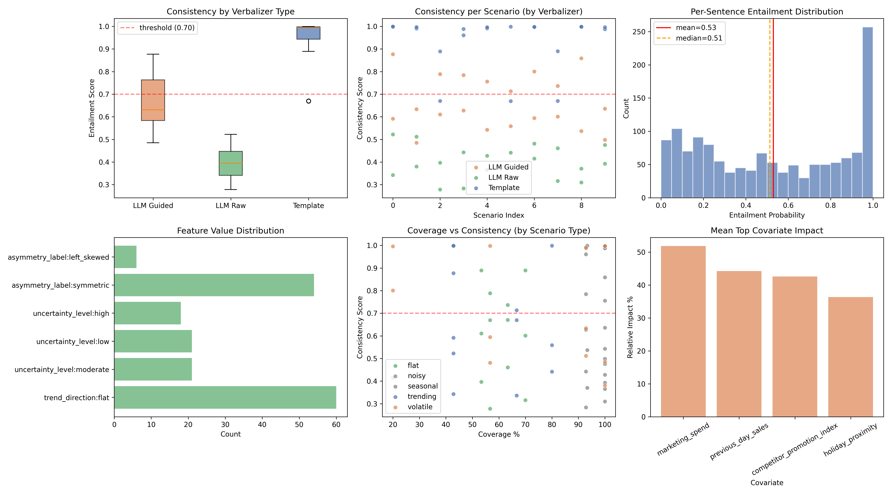

# Evaluation Report — Extension 1

> This evaluation separates two questions: (1) Is the explanation faithful to the forecast? (2) Is the forecast itself accurate? A high-scoring explanation of an inaccurate forecast is still a correct explanation.

## 1. Overview

| Metric | Value |
|---|---|
| Scenarios evaluated | 60 |
| Forecast model | `autogluon/chronos-2-small` |
| NLI model | `facebook/bart-large-mnli` |
| Consistency threshold | 0.70 |
| Mean consistency | 0.6645 |
| Std consistency | 0.2441 |
| Min consistency | 0.2783 |
| Max consistency | 0.9989 |
| % consistent (≥ 0.7) | 41.7% |

## 2. Breakdown by Verbalizer Type

| Verbalizer | Mean | Std | Min | Max | Count |
|---|---|---|---|---|---|
| LLM Guided | 0.6617 | 0.1190 | 0.4853 | 0.8772 | 20 |
| LLM Raw | 0.3976 | 0.0731 | 0.2783 | 0.5223 | 20 |
| Template | 0.9341 | 0.1184 | 0.6697 | 0.9989 | 20 |

## 3. Breakdown by Scenario Type

| Scenario | Mean | Std | Min | Max | Count |
|---|---|---|---|---|---|
| flat | 0.6090 | 0.2080 | 0.2783 | 0.8898 | 12 |
| noisy | 0.6722 | 0.2588 | 0.3654 | 0.9963 | 12 |
| seasonal | 0.6800 | 0.2843 | 0.2835 | 0.9987 | 12 |
| trending | 0.6707 | 0.2486 | 0.3359 | 0.9989 | 12 |
| volatile | 0.6904 | 0.2498 | 0.3806 | 0.9980 | 12 |

## 4. Feature Distribution

**trend_direction**: flat (60)
**trend_magnitude**: slightly (60)
**uncertainty_level**: moderate (21), low (21), high (18)
**uncertainty_trend**: widening (54), stable (6)
**asymmetry_label**: symmetric (54), left_skewed (6)

- Downside risk flagged: 30 / 60
- Upside potential flagged: 18 / 60
- Regime shift detected: 33 / 60

## 5. Covariate Attribution Summary

- Mean surrogate R²: 0.3222
- Top covariate distribution: competitor_promotion_index (12), marketing_spend (12), previous_day_sales (3), holiday_proximity (3)
- Mean top covariate impact: 45.8%

## 6. Explanation Faithfulness (NLI consistency + quantile round-trip)

- Quantile round-trip mismatches: 0 / 60

## 7. Forecast Accuracy (model vs. synthetic actuals)

| Metric | Mean | Std | Min | Max |
|---|---|---|---|---|
| mase | 2.6196 | 1.8513 | 0.1569 | 6.8296 |
| coverage_pct | 76.2143 | 24.1834 | 20.0000 | 100.0000 |
| interval_sharpness | 1.2868 | 0.6335 | 0.2001 | 2.2413 |

## 8. 5 Lowest-Scoring Sentences

| Score | Verbalizer | Scenario | Index |
|---|---|---|---|
| 0.001 | LLM Raw | flat | 7 |
| 0.002 | LLM Raw | flat | 2 |
| 0.003 | LLM Raw | volatile | 6 |
| 0.004 | LLM Raw | flat | 7 |
| 0.005 | LLM Guided | noisy | 4 |

## 9. 5 Highest-Scoring Sentences

| Score | Verbalizer | Scenario | Index |
|---|---|---|---|
| 1.000 | Template | flat | 2 |
| 1.000 | Template | seasonal | 8 |
| 1.000 | Template | noisy | 9 |
| 1.000 | Template | trending | 0 |
| 1.000 | Template | flat | 2 |

## 10. Failure Analysis

**35 scenarios** scored below the 0.70 threshold:

### Scenario 0 (trending / LLM Raw)
- Overall score: 0.5223
- sent_0_score: 0.3532
- sent_1_score: 0.8839
- sent_2_score: 0.6739
- sent_3_score: 0.5036
- sent_4_score: 0.2834
- sent_5_score: 0.3845
- sent_6_score: 0.6184
- sent_7_score: 0.9211
- sent_8_score: 0.5746
- sent_9_score: 0.3754
- sent_10_score: 0.2468
- sent_11_score: 0.5532
- sent_12_score: 0.7119
- sent_13_score: 0.2910
- sent_14_score: 0.7409
- sent_15_score: 0.1396
- sent_16_score: 0.3180
- sent_17_score: 0.8821
- sent_18_score: 0.9095
- sent_19_score: 0.0411
- sent_20_score: 0.9505
- sent_21_score: 0.4199
- sent_22_score: 0.1782
- sent_23_score: 0.6045
- sent_24_score: 0.5404
- sent_25_score: 0.8616
- sent_26_score: 0.3244
- sent_27_score: 0.0730
- sent_28_score: 0.7878

### Scenario 1 (volatile / LLM Guided)
- Overall score: 0.6337
- sent_0_score: 0.9972
- sent_1_score: 0.9926
- sent_2_score: 0.4368
- sent_3_score: 0.0199
- sent_4_score: 0.7670
- sent_5_score: 0.9028
- sent_6_score: 0.8476
- sent_7_score: 0.7245
- sent_8_score: 0.2182
- sent_9_score: 0.1467
- sent_10_score: 0.4024
- sent_11_score: 0.0747
- sent_12_score: 0.7460
- sent_13_score: 0.9053
- sent_14_score: 0.7333
- sent_15_score: 0.9024
- sent_16_score: 0.4088
- sent_17_score: 0.8712
- sent_18_score: 0.8553
- sent_19_score: 0.7210

### Scenario 1 (volatile / LLM Raw)
- Overall score: 0.5120
- sent_0_score: 0.2229
- sent_1_score: 0.5537
- sent_2_score: 0.2439
- sent_3_score: 0.8746
- sent_4_score: 0.1756
- sent_5_score: 0.2243
- sent_6_score: 0.3600
- sent_7_score: 0.0466
- sent_8_score: 0.4783
- sent_9_score: 0.8042
- sent_10_score: 0.9668
- sent_11_score: 0.6197
- sent_12_score: 0.0598
- sent_13_score: 0.4249
- sent_14_score: 0.7307
- sent_15_score: 0.2523
- sent_16_score: 0.4316
- sent_17_score: 0.5399
- sent_18_score: 0.9118
- sent_19_score: 0.4492
- sent_20_score: 0.4983
- sent_21_score: 0.6381
- sent_22_score: 0.8143
- sent_23_score: 0.1078
- sent_24_score: 0.5844
- sent_25_score: 0.3553
- sent_26_score: 0.8646
- sent_27_score: 0.2927
- sent_28_score: 0.5876
- sent_29_score: 0.8388
- sent_30_score: 0.8595
- sent_31_score: 0.3930
- sent_32_score: 0.6905

### Scenario 2 (flat / Template)
- Overall score: 0.6699
- sent_0_score: 0.9996
- sent_1_score: 0.0111
- sent_2_score: 0.9990

### Scenario 2 (flat / LLM Raw)
- Overall score: 0.2783
- sent_0_score: 0.6047
- sent_1_score: 0.1370
- sent_2_score: 0.4837
- sent_3_score: 0.1756
- sent_4_score: 0.3697
- sent_5_score: 0.0770
- sent_6_score: 0.2620
- sent_7_score: 0.1609
- sent_8_score: 0.1188
- sent_9_score: 0.8323
- sent_10_score: 0.2171
- sent_11_score: 0.2720
- sent_12_score: 0.5929
- sent_13_score: 0.1506
- sent_14_score: 0.5282
- sent_15_score: 0.1066
- sent_16_score: 0.0206
- sent_17_score: 0.4619
- sent_18_score: 0.1749
- sent_19_score: 0.1360
- sent_20_score: 0.4034
- sent_21_score: 0.4034
- sent_22_score: 0.1191
- sent_23_score: 0.2829
- sent_24_score: 0.4779
- sent_25_score: 0.2405
- sent_26_score: 0.1348
- sent_27_score: 0.5076
- sent_28_score: 0.2122
- sent_29_score: 0.2132
- sent_30_score: 0.1951
- sent_31_score: 0.0747
- sent_32_score: 0.3177
- sent_33_score: 0.4382
- sent_34_score: 0.1898
- sent_35_score: 0.4872
- sent_36_score: 0.7188
- sent_37_score: 0.0949
- sent_38_score: 0.4072
- sent_39_score: 0.0724
- sent_40_score: 0.0579
- sent_41_score: 0.2178
- sent_42_score: 0.1830
- sent_43_score: 0.0584
- sent_44_score: 0.1394
- sent_45_score: 0.1797
- sent_46_score: 0.0292
- sent_47_score: 0.0206
- sent_48_score: 0.0800
- sent_49_score: 0.8326
- sent_50_score: 0.5647
- sent_51_score: 0.2002
- sent_52_score: 0.0199
- sent_53_score: 0.0735
- sent_54_score: 0.7749

### Scenario 3 (seasonal / LLM Raw)
- Overall score: 0.4427
- sent_0_score: 0.6457
- sent_1_score: 0.3168
- sent_2_score: 0.6128
- sent_3_score: 0.3486
- sent_4_score: 0.2926
- sent_5_score: 0.3133
- sent_6_score: 0.4265
- sent_7_score: 0.7252
- sent_8_score: 0.6062
- sent_9_score: 0.1584
- sent_10_score: 0.3203
- sent_11_score: 0.1393
- sent_12_score: 0.1325
- sent_13_score: 0.3336
- sent_14_score: 0.9430
- sent_15_score: 0.8754
- sent_16_score: 0.7986
- sent_17_score: 0.8545
- sent_18_score: 0.3135
- sent_19_score: 0.0206
- sent_20_score: 0.1774
- sent_21_score: 0.3840

### Scenario 4 (noisy / LLM Raw)
- Overall score: 0.4278
- sent_0_score: 0.5288
- sent_1_score: 0.0233
- sent_2_score: 0.7581
- sent_3_score: 0.5929
- sent_4_score: 0.1756
- sent_5_score: 0.8396
- sent_6_score: 0.6077
- sent_7_score: 0.2698
- sent_8_score: 0.2620
- sent_9_score: 0.8348
- sent_10_score: 0.5142
- sent_11_score: 0.5139
- sent_12_score: 0.2159
- sent_13_score: 0.5603
- sent_14_score: 0.2171
- sent_15_score: 0.4599
- sent_16_score: 0.8912
- sent_17_score: 0.6688
- sent_18_score: 0.1506
- sent_19_score: 0.5464
- sent_20_score: 0.4464
- sent_21_score: 0.0573
- sent_22_score: 0.1749
- sent_23_score: 0.6454
- sent_24_score: 0.7153
- sent_25_score: 0.2070
- sent_26_score: 0.4625
- sent_27_score: 0.1191
- sent_28_score: 0.5502
- sent_29_score: 0.0138
- sent_30_score: 0.2405
- sent_31_score: 0.9655
- sent_32_score: 0.6401
- sent_33_score: 0.6400
- sent_34_score: 0.2122
- sent_35_score: 0.8222
- sent_36_score: 0.5289
- sent_37_score: 0.7118
- sent_38_score: 0.0747
- sent_39_score: 0.4391
- sent_40_score: 0.0219
- sent_41_score: 0.0178
- sent_42_score: 0.2400
- sent_43_score: 0.6974
- sent_44_score: 0.1898
- sent_45_score: 0.3371
- sent_46_score: 0.2683
- sent_47_score: 0.0949
- sent_48_score: 0.1710
- sent_49_score: 0.0910
- sent_50_score: 0.1170
- sent_51_score: 0.6308
- sent_52_score: 0.8525
- sent_53_score: 0.7749
- sent_54_score: 0.7273

### Scenario 5 (trending / Template)
- Overall score: 0.6697
- sent_0_score: 0.9995
- sent_1_score: 0.0106
- sent_2_score: 0.9990

### Scenario 5 (trending / LLM Raw)
- Overall score: 0.3359
- sent_0_score: 0.5580
- sent_1_score: 0.2066
- sent_2_score: 0.6906
- sent_3_score: 0.4032
- sent_4_score: 0.1756
- sent_5_score: 0.7822
- sent_6_score: 0.6729
- sent_7_score: 0.2620
- sent_8_score: 0.0140
- sent_9_score: 0.3186
- sent_10_score: 0.4817
- sent_11_score: 0.5701
- sent_12_score: 0.6108
- sent_13_score: 0.2171
- sent_14_score: 0.0277
- sent_15_score: 0.2744
- sent_16_score: 0.2195
- sent_17_score: 0.3649
- sent_18_score: 0.3266
- sent_19_score: 0.1506
- sent_20_score: 0.4794
- sent_21_score: 0.3902
- sent_22_score: 0.4381
- sent_23_score: 0.1749
- sent_24_score: 0.6422
- sent_25_score: 0.8013
- sent_26_score: 0.1191
- sent_27_score: 0.1279
- sent_28_score: 0.2866
- sent_29_score: 0.4939
- sent_30_score: 0.3836
- sent_31_score: 0.2405
- sent_32_score: 0.0264
- sent_33_score: 0.1602
- sent_34_score: 0.9460
- sent_35_score: 0.2122
- sent_36_score: 0.1768
- sent_37_score: 0.1883
- sent_38_score: 0.3052
- sent_39_score: 0.6503
- sent_40_score: 0.0747
- sent_41_score: 0.5955
- sent_42_score: 0.5241
- sent_43_score: 0.1898
- sent_44_score: 0.1195
- sent_45_score: 0.5241
- sent_46_score: 0.0949
- sent_47_score: 0.0248
- sent_48_score: 0.2368
- sent_49_score: 0.1830
- sent_50_score: 0.0318
- sent_51_score: 0.2972

### Scenario 6 (volatile / LLM Raw)
- Overall score: 0.4151
- sent_0_score: 0.5302
- sent_1_score: 0.5594
- sent_2_score: 0.5101
- sent_3_score: 0.0466
- sent_4_score: 0.2233
- sent_5_score: 0.0140
- sent_6_score: 0.4377
- sent_7_score: 0.6688
- sent_8_score: 0.3970
- sent_9_score: 0.4228
- sent_10_score: 0.6365
- sent_11_score: 0.0429
- sent_12_score: 0.0430
- sent_13_score: 0.4609
- sent_14_score: 0.0665
- sent_15_score: 0.7131
- sent_16_score: 0.3123
- sent_17_score: 0.2037
- sent_18_score: 0.7907
- sent_19_score: 0.4672
- sent_20_score: 0.4655
- sent_21_score: 0.3437
- sent_22_score: 0.9310
- sent_23_score: 0.0025
- sent_24_score: 0.1490
- sent_25_score: 0.5821
- sent_26_score: 0.8515
- sent_27_score: 0.7500

### Scenario 7 (flat / Template)
- Overall score: 0.6701
- sent_0_score: 0.9995
- sent_1_score: 0.0117
- sent_2_score: 0.9990

### Scenario 7 (flat / LLM Raw)
- Overall score: 0.4609
- sent_0_score: 0.3624
- sent_1_score: 0.0113
- sent_2_score: 0.4645
- sent_3_score: 0.1539
- sent_4_score: 0.7354
- sent_5_score: 0.5482
- sent_6_score: 0.6321
- sent_7_score: 0.1213
- sent_8_score: 0.1628
- sent_9_score: 0.4716
- sent_10_score: 0.6186
- sent_11_score: 0.7159
- sent_12_score: 0.7054
- sent_13_score: 0.7242
- sent_14_score: 0.8543
- sent_15_score: 0.0750
- sent_16_score: 0.0291
- sent_17_score: 0.3797
- sent_18_score: 0.5154
- sent_19_score: 0.7312
- sent_20_score: 0.3950
- sent_21_score: 0.5880
- sent_22_score: 0.6052

### Scenario 8 (seasonal / LLM Raw)
- Overall score: 0.3097
- sent_0_score: 0.2935
- sent_1_score: 0.1248
- sent_2_score: 0.0960
- sent_3_score: 0.1253
- sent_4_score: 0.1485
- sent_5_score: 0.9599
- sent_6_score: 0.7901
- sent_7_score: 0.5353
- sent_8_score: 0.3011
- sent_9_score: 0.0572
- sent_10_score: 0.1792
- sent_11_score: 0.0957
- sent_12_score: 0.1539
- sent_13_score: 0.6469
- sent_14_score: 0.2209
- sent_15_score: 0.0546
- sent_16_score: 0.4663
- sent_17_score: 0.7630
- sent_18_score: 0.0481
- sent_19_score: 0.2251
- sent_20_score: 0.0126
- sent_21_score: 0.0378
- sent_22_score: 0.7879

### Scenario 9 (noisy / LLM Guided)
- Overall score: 0.4986
- sent_0_score: 0.8329
- sent_1_score: 0.5733
- sent_2_score: 0.9759
- sent_3_score: 0.0898
- sent_4_score: 0.5772
- sent_5_score: 0.9732
- sent_6_score: 0.0971
- sent_7_score: 0.8552
- sent_8_score: 0.4844
- sent_9_score: 0.4966
- sent_10_score: 0.9673
- sent_11_score: 0.0898
- sent_12_score: 0.9668
- sent_13_score: 0.2332
- sent_14_score: 0.4966
- sent_15_score: 0.9802
- sent_16_score: 0.0653
- sent_17_score: 0.9855
- sent_18_score: 0.9333
- sent_19_score: 0.1001
- sent_20_score: 0.9236
- sent_21_score: 0.9152
- sent_22_score: 0.2379
- sent_23_score: 0.9883
- sent_24_score: 0.2318
- sent_25_score: 0.9807
- sent_26_score: 0.0733
- sent_27_score: 0.8033
- sent_28_score: 0.2414
- sent_29_score: 0.9988
- sent_30_score: 0.0501
- sent_31_score: 0.9802
- sent_32_score: 0.1559
- sent_33_score: 0.9584
- sent_34_score: 0.1112
- sent_35_score: 0.6850
- sent_36_score: 0.0916
- sent_37_score: 0.4966
- sent_38_score: 0.8731
- sent_39_score: 0.0753
- sent_40_score: 0.0430
- sent_41_score: 0.0927
- sent_42_score: 0.3913
- sent_43_score: 0.3163
- sent_44_score: 0.2116
- sent_45_score: 0.0871
- sent_46_score: 0.0061
- sent_47_score: 0.0564
- sent_48_score: 0.7055
- sent_49_score: 0.1816
- sent_50_score: 0.4579
- sent_51_score: 0.4842
- sent_52_score: 0.1109
- sent_53_score: 0.9879
- sent_54_score: 0.9387
- sent_55_score: 0.1018
- sent_56_score: 0.0290
- sent_57_score: 0.1821
- sent_58_score: 0.7817
- sent_59_score: 0.9884
- sent_60_score: 0.2001
- sent_61_score: 0.9137

### Scenario 9 (noisy / LLM Raw)
- Overall score: 0.4759
- sent_0_score: 0.3983
- sent_1_score: 0.5131
- sent_2_score: 0.2063
- sent_3_score: 0.0618
- sent_4_score: 0.6481
- sent_5_score: 0.7523
- sent_6_score: 0.8852
- sent_7_score: 0.2296
- sent_8_score: 0.3664
- sent_9_score: 0.0811
- sent_10_score: 0.2625
- sent_11_score: 0.1104
- sent_12_score: 0.7670
- sent_13_score: 0.0921
- sent_14_score: 0.7536
- sent_15_score: 0.6403
- sent_16_score: 0.1566
- sent_17_score: 0.5667
- sent_18_score: 0.6106
- sent_19_score: 0.6087
- sent_20_score: 0.2252
- sent_21_score: 0.7362
- sent_22_score: 0.4611
- sent_23_score: 0.6557
- sent_24_score: 0.8407
- sent_25_score: 0.7445

### Scenario 0 (trending / LLM Guided)
- Overall score: 0.5917
- sent_0_score: 0.9719
- sent_1_score: 0.7825
- sent_2_score: 0.9829
- sent_3_score: 0.9982
- sent_4_score: 0.0973
- sent_5_score: 0.5124
- sent_6_score: 0.7138
- sent_7_score: 0.0670
- sent_8_score: 0.2040
- sent_9_score: 0.8741
- sent_10_score: 0.9760
- sent_11_score: 0.0772
- sent_12_score: 0.6012
- sent_13_score: 0.6051
- sent_14_score: 0.9699
- sent_15_score: 0.0342
- sent_16_score: 0.9628
- sent_17_score: 0.3977
- sent_18_score: 0.2197
- sent_19_score: 0.8633
- sent_20_score: 0.8428
- sent_21_score: 0.4679
- sent_22_score: 0.9640
- sent_23_score: 0.2983
- sent_24_score: 0.9754
- sent_25_score: 0.2314
- sent_26_score: 0.7049
- sent_27_score: 0.9968
- sent_28_score: 0.1760
- sent_29_score: 0.3062
- sent_30_score: 0.6307
- sent_31_score: 0.2915
- sent_32_score: 0.9612
- sent_33_score: 0.0390
- sent_34_score: 0.9278
- sent_35_score: 0.3512
- sent_36_score: 0.7444
- sent_37_score: 0.0982
- sent_38_score: 0.2169
- sent_39_score: 0.7673
- sent_40_score: 0.1639
- sent_41_score: 0.8368
- sent_42_score: 0.7736
- sent_43_score: 0.6237
- sent_44_score: 0.8535
- sent_45_score: 0.2863
- sent_46_score: 0.7016
- sent_47_score: 0.9570
- sent_48_score: 0.2546
- sent_49_score: 0.8932
- sent_50_score: 0.6494
- sent_51_score: 0.0800
- sent_52_score: 0.8760
- sent_53_score: 0.6291
- sent_54_score: 0.9622
- sent_55_score: 0.3663
- sent_56_score: 0.9140

### Scenario 0 (trending / LLM Raw)
- Overall score: 0.3425
- sent_0_score: 0.2842
- sent_1_score: 0.4269
- sent_2_score: 0.1355
- sent_3_score: 0.1291
- sent_4_score: 0.4192
- sent_5_score: 0.4655
- sent_6_score: 0.4560
- sent_7_score: 0.0855
- sent_8_score: 0.1943
- sent_9_score: 0.2822
- sent_10_score: 0.0602
- sent_11_score: 0.1908
- sent_12_score: 0.4888
- sent_13_score: 0.4939
- sent_14_score: 0.5182
- sent_15_score: 0.2563
- sent_16_score: 0.6380
- sent_17_score: 0.7419
- sent_18_score: 0.3728
- sent_19_score: 0.3331
- sent_20_score: 0.3790
- sent_21_score: 0.0577
- sent_22_score: 0.1475
- sent_23_score: 0.8486
- sent_24_score: 0.1641
- sent_25_score: 0.7867
- sent_26_score: 0.1548
- sent_27_score: 0.7106
- sent_28_score: 0.8037
- sent_29_score: 0.8361
- sent_30_score: 0.1343
- sent_31_score: 0.1911
- sent_32_score: 0.0166
- sent_33_score: 0.4617
- sent_34_score: 0.0505
- sent_35_score: 0.0106
- sent_36_score: 0.6147
- sent_37_score: 0.0755
- sent_38_score: 0.1833
- sent_39_score: 0.1000

### Scenario 1 (volatile / LLM Guided)
- Overall score: 0.4853
- sent_0_score: 0.8822
- sent_1_score: 0.0083
- sent_2_score: 0.9695
- sent_3_score: 0.9781
- sent_4_score: 0.0521
- sent_5_score: 0.8432
- sent_6_score: 0.9754
- sent_7_score: 0.4686
- sent_8_score: 0.9742
- sent_9_score: 0.0223
- sent_10_score: 0.9069
- sent_11_score: 0.0101
- sent_12_score: 0.0334
- sent_13_score: 0.3815
- sent_14_score: 0.1051
- sent_15_score: 0.0284
- sent_16_score: 0.6938
- sent_17_score: 0.8053
- sent_18_score: 0.0785
- sent_19_score: 0.6587
- sent_20_score: 0.2583
- sent_21_score: 0.0342
- sent_22_score: 0.8707
- sent_23_score: 0.2633
- sent_24_score: 0.5333
- sent_25_score: 0.0140
- sent_26_score: 0.3879
- sent_27_score: 0.1218
- sent_28_score: 0.0271
- sent_29_score: 0.7198
- sent_30_score: 0.7657
- sent_31_score: 0.4254
- sent_32_score: 0.0223
- sent_33_score: 0.8831
- sent_34_score: 0.9939
- sent_35_score: 0.7310
- sent_36_score: 0.5624
- sent_37_score: 0.9527

### Scenario 1 (volatile / LLM Raw)
- Overall score: 0.3806
- sent_0_score: 0.3806
- sent_1_score: 0.2170
- sent_2_score: 0.3196
- sent_3_score: 0.4154
- sent_4_score: 0.1756
- sent_5_score: 0.4560
- sent_6_score: 0.1590
- sent_7_score: 0.1958
- sent_8_score: 0.2620
- sent_9_score: 0.4946
- sent_10_score: 0.4670
- sent_11_score: 0.4481
- sent_12_score: 0.2171
- sent_13_score: 0.2585
- sent_14_score: 0.4891
- sent_15_score: 0.9662
- sent_16_score: 0.1506
- sent_17_score: 0.5168
- sent_18_score: 0.0731
- sent_19_score: 0.1749
- sent_20_score: 0.5889
- sent_21_score: 0.5059
- sent_22_score: 0.5077
- sent_23_score: 0.1191
- sent_24_score: 0.5911
- sent_25_score: 0.5168
- sent_26_score: 0.1954
- sent_27_score: 0.4961
- sent_28_score: 0.2405
- sent_29_score: 0.3573
- sent_30_score: 0.8477
- sent_31_score: 0.2122
- sent_32_score: 0.0100
- sent_33_score: 0.0747
- sent_34_score: 0.9853
- sent_35_score: 0.1898
- sent_36_score: 0.9686
- sent_37_score: 0.0949
- sent_38_score: 0.7757
- sent_39_score: 0.1303
- sent_40_score: 0.3710
- sent_41_score: 0.1830
- sent_42_score: 0.0620
- sent_43_score: 0.1797
- sent_44_score: 0.0109
- sent_45_score: 0.8024
- sent_46_score: 0.2448
- sent_47_score: 0.8216
- sent_48_score: 0.7298

### Scenario 2 (flat / LLM Guided)
- Overall score: 0.6106
- sent_0_score: 0.9823
- sent_1_score: 0.8050
- sent_2_score: 0.9978
- sent_3_score: 0.2683
- sent_4_score: 0.9927
- sent_5_score: 0.4820
- sent_6_score: 0.9200
- sent_7_score: 0.2779
- sent_8_score: 0.5560
- sent_9_score: 0.0858
- sent_10_score: 0.5835
- sent_11_score: 0.0572
- sent_12_score: 0.9286

### Scenario 2 (flat / LLM Raw)
- Overall score: 0.3969
- sent_0_score: 0.5014
- sent_1_score: 0.5679
- sent_2_score: 0.3199
- sent_3_score: 0.2037
- sent_4_score: 0.8350
- sent_5_score: 0.1756
- sent_6_score: 0.4055
- sent_7_score: 0.6323
- sent_8_score: 0.3147
- sent_9_score: 0.2620
- sent_10_score: 0.5001
- sent_11_score: 0.1698
- sent_12_score: 0.8378
- sent_13_score: 0.7619
- sent_14_score: 0.2171
- sent_15_score: 0.0570
- sent_16_score: 0.1843
- sent_17_score: 0.2362
- sent_18_score: 0.1506
- sent_19_score: 0.2332
- sent_20_score: 0.0423
- sent_21_score: 0.1749
- sent_22_score: 0.2162
- sent_23_score: 0.7707
- sent_24_score: 0.1191
- sent_25_score: 0.6623
- sent_26_score: 0.4021
- sent_27_score: 0.2486
- sent_28_score: 0.8926
- sent_29_score: 0.2405
- sent_30_score: 0.3288
- sent_31_score: 0.0024
- sent_32_score: 0.3322
- sent_33_score: 0.2164
- sent_34_score: 0.7172
- sent_35_score: 0.2122
- sent_36_score: 0.8602
- sent_37_score: 0.6485
- sent_38_score: 0.2402
- sent_39_score: 0.4916
- sent_40_score: 0.0747
- sent_41_score: 0.8077
- sent_42_score: 0.2423
- sent_43_score: 0.0936
- sent_44_score: 0.4834
- sent_45_score: 0.8003
- sent_46_score: 0.4035
- sent_47_score: 0.7080
- sent_48_score: 0.5565
- sent_49_score: 0.1444
- sent_50_score: 0.2799
- sent_51_score: 0.6620

### Scenario 3 (seasonal / LLM Guided)
- Overall score: 0.6275
- sent_0_score: 0.9077
- sent_1_score: 0.1544
- sent_2_score: 0.8949
- sent_3_score: 0.6350
- sent_4_score: 0.4131
- sent_5_score: 0.1401
- sent_6_score: 0.3845
- sent_7_score: 0.9036
- sent_8_score: 0.9412
- sent_9_score: 0.9992
- sent_10_score: 0.0704
- sent_11_score: 0.9519
- sent_12_score: 0.9980
- sent_13_score: 0.1249
- sent_14_score: 0.9830
- sent_15_score: 0.1826
- sent_16_score: 0.9742
- sent_17_score: 0.0503
- sent_18_score: 0.9640
- sent_19_score: 0.4705
- sent_20_score: 0.9266
- sent_21_score: 0.0745
- sent_22_score: 0.9661
- sent_23_score: 0.9503

### Scenario 3 (seasonal / LLM Raw)
- Overall score: 0.2835
- sent_0_score: 0.5459
- sent_1_score: 0.5321
- sent_2_score: 0.0815
- sent_3_score: 0.5255
- sent_4_score: 0.1756
- sent_5_score: 0.5862
- sent_6_score: 0.2620
- sent_7_score: 0.0990
- sent_8_score: 0.6689
- sent_9_score: 0.2171
- sent_10_score: 0.0615
- sent_11_score: 0.5857
- sent_12_score: 0.1506
- sent_13_score: 0.0973
- sent_14_score: 0.1749
- sent_15_score: 0.0880
- sent_16_score: 0.1191
- sent_17_score: 0.0928
- sent_18_score: 0.7788
- sent_19_score: 0.2405
- sent_20_score: 0.0234
- sent_21_score: 0.5119
- sent_22_score: 0.2122
- sent_23_score: 0.0762
- sent_24_score: 0.7147
- sent_25_score: 0.0747
- sent_26_score: 0.1296
- sent_27_score: 0.4579
- sent_28_score: 0.1898
- sent_29_score: 0.0283
- sent_30_score: 0.0949
- sent_31_score: 0.0227
- sent_32_score: 0.1830
- sent_33_score: 0.0099
- sent_34_score: 0.1797
- sent_35_score: 0.3540
- sent_36_score: 0.7857
- sent_37_score: 0.1754
- sent_38_score: 0.1422
- sent_39_score: 0.2278
- sent_40_score: 0.0086
- sent_41_score: 0.1192
- sent_42_score: 0.7700
- sent_43_score: 0.8979

### Scenario 4 (noisy / LLM Guided)
- Overall score: 0.5430
- sent_0_score: 0.7429
- sent_1_score: 0.0204
- sent_2_score: 0.9639
- sent_3_score: 0.0324
- sent_4_score: 0.9958
- sent_5_score: 0.0059
- sent_6_score: 0.9920
- sent_7_score: 0.7782
- sent_8_score: 0.2476
- sent_9_score: 0.2746
- sent_10_score: 0.0054
- sent_11_score: 0.7085
- sent_12_score: 0.1916
- sent_13_score: 0.0435
- sent_14_score: 0.9554
- sent_15_score: 0.9310
- sent_16_score: 0.9850
- sent_17_score: 0.8994

### Scenario 4 (noisy / LLM Raw)
- Overall score: 0.3654
- sent_0_score: 0.4692
- sent_1_score: 0.6442
- sent_2_score: 0.1265
- sent_3_score: 0.7176
- sent_4_score: 0.1756
- sent_5_score: 0.5396
- sent_6_score: 0.1260
- sent_7_score: 0.6457
- sent_8_score: 0.2620
- sent_9_score: 0.4018
- sent_10_score: 0.1998
- sent_11_score: 0.1610
- sent_12_score: 0.7526
- sent_13_score: 0.2171
- sent_14_score: 0.5472
- sent_15_score: 0.1520
- sent_16_score: 0.2278
- sent_17_score: 0.1506
- sent_18_score: 0.2977
- sent_19_score: 0.1422
- sent_20_score: 0.1749
- sent_21_score: 0.8096
- sent_22_score: 0.6939
- sent_23_score: 0.1191
- sent_24_score: 0.5776
- sent_25_score: 0.5039
- sent_26_score: 0.0905
- sent_27_score: 0.2405
- sent_28_score: 0.4733
- sent_29_score: 0.2739
- sent_30_score: 0.0523
- sent_31_score: 0.0288
- sent_32_score: 0.0523
- sent_33_score: 0.0538
- sent_34_score: 0.0934
- sent_35_score: 0.2648
- sent_36_score: 0.1539
- sent_37_score: 0.2122
- sent_38_score: 0.7535
- sent_39_score: 0.4834
- sent_40_score: 0.2019
- sent_41_score: 0.8195
- sent_42_score: 0.0747
- sent_43_score: 0.2656
- sent_44_score: 0.2467
- sent_45_score: 0.1110
- sent_46_score: 0.8714
- sent_47_score: 0.8026
- sent_48_score: 0.2775
- sent_49_score: 0.5453
- sent_50_score: 0.8497
- sent_51_score: 0.8721

### Scenario 5 (trending / LLM Guided)
- Overall score: 0.5588
- sent_0_score: 0.3064
- sent_1_score: 0.2741
- sent_2_score: 0.9172
- sent_3_score: 0.8562
- sent_4_score: 0.0445
- sent_5_score: 0.9846
- sent_6_score: 0.3802
- sent_7_score: 0.4254
- sent_8_score: 0.9987
- sent_9_score: 0.0741
- sent_10_score: 0.9813
- sent_11_score: 0.0684
- sent_12_score: 0.4885
- sent_13_score: 0.0894
- sent_14_score: 0.9874
- sent_15_score: 0.0741
- sent_16_score: 0.7186
- sent_17_score: 0.6901
- sent_18_score: 0.1759
- sent_19_score: 0.6896
- sent_20_score: 0.4982
- sent_21_score: 0.8192
- sent_22_score: 0.5424
- sent_23_score: 0.9983
- sent_24_score: 0.4897
- sent_25_score: 0.9559

### Scenario 5 (trending / LLM Raw)
- Overall score: 0.4416
- sent_0_score: 0.4619
- sent_1_score: 0.0353
- sent_2_score: 0.4566
- sent_3_score: 0.4567
- sent_4_score: 0.1967
- sent_5_score: 0.0618
- sent_6_score: 0.3704
- sent_7_score: 0.8297
- sent_8_score: 0.2403
- sent_9_score: 0.2335
- sent_10_score: 0.9926
- sent_11_score: 0.4189
- sent_12_score: 0.5229
- sent_13_score: 0.7302
- sent_14_score: 0.0602
- sent_15_score: 0.6411
- sent_16_score: 0.3528
- sent_17_score: 0.2612
- sent_18_score: 0.6490
- sent_19_score: 0.1918
- sent_20_score: 0.2397
- sent_21_score: 0.5614
- sent_22_score: 0.4582
- sent_23_score: 0.4446
- sent_24_score: 0.6285
- sent_25_score: 0.4882
- sent_26_score: 0.1650
- sent_27_score: 0.9266
- sent_28_score: 0.4990
- sent_29_score: 0.0317
- sent_30_score: 0.5489
- sent_31_score: 0.9245
- sent_32_score: 0.0715
- sent_33_score: 0.1734
- sent_34_score: 0.5553
- sent_35_score: 0.5190
- sent_36_score: 0.7700
- sent_37_score: 0.4124
- sent_38_score: 0.2699
- sent_39_score: 0.8132

### Scenario 6 (volatile / LLM Guided)
- Overall score: 0.5946
- sent_0_score: 0.8382
- sent_1_score: 0.8793
- sent_2_score: 0.7150
- sent_3_score: 0.9276
- sent_4_score: 0.7263
- sent_5_score: 0.9348
- sent_6_score: 0.7481
- sent_7_score: 0.1381
- sent_8_score: 0.7592
- sent_9_score: 0.2664
- sent_10_score: 0.6132
- sent_11_score: 0.0444
- sent_12_score: 0.6928
- sent_13_score: 0.5901
- sent_14_score: 0.1781
- sent_15_score: 0.0739
- sent_16_score: 0.9824

### Scenario 6 (volatile / LLM Raw)
- Overall score: 0.4812
- sent_0_score: 0.9452
- sent_1_score: 0.4796
- sent_2_score: 0.0778
- sent_3_score: 0.9601
- sent_4_score: 0.5092
- sent_5_score: 0.1140
- sent_6_score: 0.3186
- sent_7_score: 0.9056
- sent_8_score: 0.4287
- sent_9_score: 0.9346
- sent_10_score: 0.4060
- sent_11_score: 0.0689
- sent_12_score: 0.2126
- sent_13_score: 0.6074
- sent_14_score: 0.3350
- sent_15_score: 0.1078
- sent_16_score: 0.3468
- sent_17_score: 0.3645
- sent_18_score: 0.7693
- sent_19_score: 0.2288
- sent_20_score: 0.9850

### Scenario 7 (flat / LLM Guided)
- Overall score: 0.6010
- sent_0_score: 0.9663
- sent_1_score: 0.3987
- sent_2_score: 0.9990
- sent_3_score: 0.9496
- sent_4_score: 0.1222
- sent_5_score: 0.9355
- sent_6_score: 0.1353
- sent_7_score: 0.3331
- sent_8_score: 0.0735
- sent_9_score: 0.0105
- sent_10_score: 0.9348
- sent_11_score: 0.5281
- sent_12_score: 0.8166
- sent_13_score: 0.6599
- sent_14_score: 0.8558
- sent_15_score: 0.6979
- sent_16_score: 0.7996

### Scenario 7 (flat / LLM Raw)
- Overall score: 0.3160
- sent_0_score: 0.4207
- sent_1_score: 0.1939
- sent_2_score: 0.3938
- sent_3_score: 0.7561
- sent_4_score: 0.4392
- sent_5_score: 0.1756
- sent_6_score: 0.0173
- sent_7_score: 0.1623
- sent_8_score: 0.7576
- sent_9_score: 0.2620
- sent_10_score: 0.0094
- sent_11_score: 0.0879
- sent_12_score: 0.1165
- sent_13_score: 0.3223
- sent_14_score: 0.7847
- sent_15_score: 0.2171
- sent_16_score: 0.1080
- sent_17_score: 0.4916
- sent_18_score: 0.1506
- sent_19_score: 0.0400
- sent_20_score: 0.1091
- sent_21_score: 0.5138
- sent_22_score: 0.1749
- sent_23_score: 0.0317
- sent_24_score: 0.7824
- sent_25_score: 0.8607
- sent_26_score: 0.1191
- sent_27_score: 0.0090
- sent_28_score: 0.6342
- sent_29_score: 0.7381
- sent_30_score: 0.2405
- sent_31_score: 0.3934
- sent_32_score: 0.3587
- sent_33_score: 0.5448
- sent_34_score: 0.2122
- sent_35_score: 0.0841
- sent_36_score: 0.4875
- sent_37_score: 0.0747
- sent_38_score: 0.0334
- sent_39_score: 0.5092
- sent_40_score: 0.1898
- sent_41_score: 0.0061
- sent_42_score: 0.8187
- sent_43_score: 0.0949
- sent_44_score: 0.0119
- sent_45_score: 0.0779
- sent_46_score: 0.8807
- sent_47_score: 0.1830
- sent_48_score: 0.0038
- sent_49_score: 0.5356
- sent_50_score: 0.1797
- sent_51_score: 0.0011
- sent_52_score: 0.3925
- sent_53_score: 0.8686

### Scenario 8 (seasonal / LLM Guided)
- Overall score: 0.5370
- sent_0_score: 0.9497
- sent_1_score: 0.1552
- sent_2_score: 0.9718
- sent_3_score: 0.1423
- sent_4_score: 0.9901
- sent_5_score: 0.0100
- sent_6_score: 0.4597
- sent_7_score: 0.1159
- sent_8_score: 0.9479
- sent_9_score: 0.9817
- sent_10_score: 0.1353
- sent_11_score: 0.2121
- sent_12_score: 0.1068
- sent_13_score: 0.9569
- sent_14_score: 0.9665
- sent_15_score: 0.2934
- sent_16_score: 0.7340

### Scenario 8 (seasonal / LLM Raw)
- Overall score: 0.3705
- sent_0_score: 0.4527
- sent_1_score: 0.4424
- sent_2_score: 0.2883
- sent_3_score: 0.6898
- sent_4_score: 0.2144
- sent_5_score: 0.0770
- sent_6_score: 0.6063
- sent_7_score: 0.2428
- sent_8_score: 0.7709
- sent_9_score: 0.4735
- sent_10_score: 0.3003
- sent_11_score: 0.5322
- sent_12_score: 0.0293
- sent_13_score: 0.2572
- sent_14_score: 0.3967
- sent_15_score: 0.0804
- sent_16_score: 0.7276
- sent_17_score: 0.1855
- sent_18_score: 0.1853
- sent_19_score: 0.6504
- sent_20_score: 0.3002
- sent_21_score: 0.2469
- sent_22_score: 0.4668
- sent_23_score: 0.2759

### Scenario 9 (noisy / LLM Guided)
- Overall score: 0.6360
- sent_0_score: 0.3057
- sent_1_score: 0.5490
- sent_2_score: 0.7524
- sent_3_score: 0.8828
- sent_4_score: 0.6979
- sent_5_score: 0.8157
- sent_6_score: 0.8445
- sent_7_score: 0.9300
- sent_8_score: 0.3427
- sent_9_score: 0.9478
- sent_10_score: 0.8918
- sent_11_score: 0.9280
- sent_12_score: 0.5677
- sent_13_score: 0.9049
- sent_14_score: 0.8027
- sent_15_score: 0.6599
- sent_16_score: 0.4650
- sent_17_score: 0.9410
- sent_18_score: 0.5821
- sent_19_score: 0.8327
- sent_20_score: 0.8881
- sent_21_score: 0.8238
- sent_22_score: 0.5821
- sent_23_score: 0.4269
- sent_24_score: 0.9332
- sent_25_score: 0.0913
- sent_26_score: 0.8506
- sent_27_score: 0.9202
- sent_28_score: 0.8855
- sent_29_score: 0.2742
- sent_30_score: 0.7744
- sent_31_score: 0.7847
- sent_32_score: 0.9673
- sent_33_score: 0.1042
- sent_34_score: 0.8650
- sent_35_score: 0.7125
- sent_36_score: 0.2319
- sent_37_score: 0.9007
- sent_38_score: 0.8912
- sent_39_score: 0.6394
- sent_40_score: 0.5457
- sent_41_score: 0.0653
- sent_42_score: 0.9251
- sent_43_score: 0.7585
- sent_44_score: 0.0291
- sent_45_score: 0.8701
- sent_46_score: 0.6893
- sent_47_score: 0.0702
- sent_48_score: 0.8704
- sent_49_score: 0.0429
- sent_50_score: 0.0375
- sent_51_score: 0.9875
- sent_52_score: 0.7788
- sent_53_score: 0.4590
- sent_54_score: 0.0288
- sent_55_score: 0.6794
- sent_56_score: 0.8455
- sent_57_score: 0.0110

### Scenario 9 (noisy / LLM Raw)
- Overall score: 0.3928
- sent_0_score: 0.0797
- sent_1_score: 0.4109
- sent_2_score: 0.2596
- sent_3_score: 0.9520
- sent_4_score: 0.1338
- sent_5_score: 0.3222
- sent_6_score: 0.6426
- sent_7_score: 0.4818
- sent_8_score: 0.0381
- sent_9_score: 0.0648
- sent_10_score: 0.9054
- sent_11_score: 0.1490
- sent_12_score: 0.1035
- sent_13_score: 0.8114
- sent_14_score: 0.4498
- sent_15_score: 0.7088
- sent_16_score: 0.3451
- sent_17_score: 0.2903
- sent_18_score: 0.1212
- sent_19_score: 0.2632
- sent_20_score: 0.5220
- sent_21_score: 0.8178
- sent_22_score: 0.4579
- sent_23_score: 0.0804
- sent_24_score: 0.4083

## 11. RST Relation Distribution

| Relation | Count |
|---|---|
| elaboration | 22 |
| cause | 20 |
| contrast | 18 |

## Visualizations

