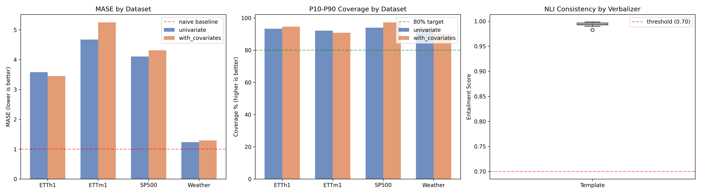

# Real Dataset Evaluation Report — Extension 1

> Mode: **dev** — Fast dev mode — 5 windows, 96-step horizon (512 history)
> History: 512 steps | Horizon: 96 steps
> ETTh1 and Weather use their official test splits for comparability with published benchmarks.

## 1. Overview

| Metric | Value |
|---|---|
| Total rows evaluated | 40 |
| Datasets | ETTh1, ETTm1, SP500, Weather |
| Verbalizers | Template |
| Mean NLI consistency | 0.9947 |
| PASS rate (≥ 0.70) | 100.0% |
| Mean MASE | 3.4870 |
| Mean First-Step MASE | 1.3007 |
| Mean fair_mase | 0.7812 |
| Mean coverage | 93.2% |

## 2. Forecast Accuracy by Dataset and Covariate Mode

| Dataset | Mode | Mean MASE | Mean First-Step MASE | Mean fair_mase | Mean Coverage | Mean Sharpness |
|---|---|---|---|---|---|---|
| ETTh1 | univariate | 3.5799 | 2.1894 | 0.8343 | 93.3% | 1.2797 |
| ETTh1 | with_covariates | 3.4507 | 2.4469 | 0.8272 | 94.6% | 1.2608 |
| ETTm1 | univariate | 4.6728 | 1.1610 | 0.7328 | 92.1% | 1.6810 |
| ETTm1 | with_covariates | 5.2509 | 1.2263 | 0.8290 | 90.8% | 1.4942 |
| SP500 | univariate | 4.1052 | 1.1572 | 0.9805 | 94.0% | 1.6003 |
| SP500 | with_covariates | 4.3112 | 1.0676 | 1.0169 | 97.3% | 1.7614 |
| Weather | univariate | 1.2339 | 0.5893 | 0.5053 | 93.1% | 0.5897 |
| Weather | with_covariates | 1.2912 | 0.5682 | 0.5240 | 90.2% | 0.5473 |

## 3. NLI Consistency by Verbalizer Type

| Verbalizer | Mean | Std | PASS rate |
|---|---|---|---|
| Template | 0.9947 | 0.0032 | 100.0% |

## 4. Covariate Attribution

- Mean surrogate R²: 0.2993
- Top covariates: High (4), LULL (3), wind (3), HULL (2), MULL (2)

## Visualizations

