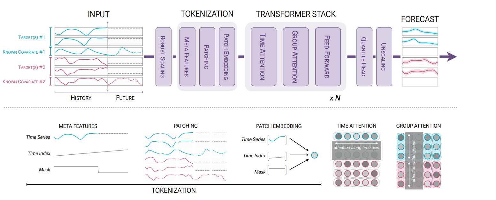

<!-- _class: lead -->

# Explainable Chronos
## A Framework for<br>Verbalization and Interactive Querying of<br>Probabilistic Time-Series Forecasts

---

## Outline

<br>

<div class="cols3">
<div>

### <span class="badge">1</span> Attention Rollout and Adapting It to Chronos 2
Classic formulation and application to Chronos 2's two attention tensors

</div>
<div>

### <span class="badge">2</span> Extension 1
Verbalization of probabilistic forecasts

</div>
<div>

### <span class="badge">3</span> Extension 2
Interactive modification and querying

</div>
</div>

---

## Why Explainability on top of Chronos-2?

Chronos-2 outputs quantile forecasts: **useful, but opaque**

<div class="cols">
<div>

What a user sees:

- P10 / P50 / P90 curves over a horizon
- No indication of *why* the model predicted that
- No indication of *which covariate mattered*

</div>
<div>

What we want:

- A plain-language summary of the forecast
- An understanding of what drove the prediction and how much each input contributed
- The ability to test alternative scenarios and observe how the forecast changes

</div>
</div>

---

<!-- _class: divider -->

# Part 1: Attention Rollout
### The problem with raw attention in deep transformers

---

## The Problem with Raw Attention

In a transformer with $L$ layers, each layer $l$ produces a square attention matrix over the input sequence. At layer 1, each position's output is already a weighted average of all inputs, a blend, not the original token. Layer 2 attends to these blends, layer 3 attends to blends of blends, and so on. By layer $L$, raw attention weights only say which late-layer mixtures were used, not which **original inputs** drove the prediction.

<div class="cols">
<div>

**Layer 1** (still interpretable):

<table class="mat">
<tr><th></th><th>t₁</th><th>t₂</th><th>t₃</th><th>t₄</th></tr>
<tr><td class="rl">t₁</td><td class="c4">0.60</td><td class="c1">0.20</td><td class="c0">0.12</td><td class="c0">0.08</td></tr>
<tr><td class="rl">t₂</td><td class="c0">0.15</td><td class="c4">0.55</td><td class="c0">0.18</td><td class="c0">0.12</td></tr>
<tr><td class="rl">t₃</td><td class="c0">0.10</td><td class="c2">0.25</td><td class="c3">0.45</td><td class="c1">0.20</td></tr>
<tr><td class="rl">t₄</td><td class="c0">0.08</td><td class="c1">0.18</td><td class="c1">0.24</td><td class="c3">0.50</td></tr>
</table>


</div>
<div>

**Layer 3** (near-uniform):

<table class="mat">
<tr><th></th><th>t₁</th><th>t₂</th><th>t₃</th><th>t₄</th></tr>
<tr><td class="rl">t₁</td><td class="c1">0.27</td><td class="c1">0.26</td><td class="c1">0.25</td><td class="c1">0.22</td></tr>
<tr><td class="rl">t₂</td><td class="c1">0.25</td><td class="c1">0.28</td><td class="c1">0.24</td><td class="c1">0.23</td></tr>
<tr><td class="rl">t₃</td><td class="c1">0.24</td><td class="c1">0.27</td><td class="c1">0.26</td><td class="c1">0.23</td></tr>
<tr><td class="rl">t₄</td><td class="c1">0.23</td><td class="c1">0.26</td><td class="c1">0.27</td><td class="c1">0.24</td></tr>
</table>

</div>
</div>

---

## Attention Rollout: Key Idea

> *Abnar & Zuidema (ACL 2020)*

<div class="cols">
<div>

**① Residual connection**

Each layer has $H$ heads and a skip connection that returns part of the signal unchanged. Average over heads, then blend with identity to model the skip:

$$W^{(l)}_{\text{avg}} = \frac{1}{H}\sum_{h} W^{(l)}_h \qquad A^{(l)} = 0.5\,W^{(l)}_{\text{avg}} + 0.5\,I$$

</div>
<div>

**② Layer composition**

Instead of reading a single layer's attention, multiply the corrected matrices across all layers so attribution is traced back to the original inputs:

$$\tilde{A}^{(l)} = A^{(l)} \cdot \tilde{A}^{(l-1)}, \quad \tilde{A}^{(0)} = I$$

</div>
</div>

The final matrix $\tilde{A}^{(L)}$ approximates **how much information each input token contributed to each output token**, accounting for all residual and mixing effects across layers.

---

## Rollout in Action: Layer by Layer

<div class="cols3">
<div>

**$\tilde{A}^{(1)}$** after layer 1:

<table class="mat-sm">
<tr><th></th><th>t₁</th><th>t₂</th><th>t₃</th><th>t₄</th></tr>
<tr><td class="rl">t₁</td><td class="c4">0.80</td><td class="c0">0.10</td><td class="c0">0.06</td><td class="c0">0.04</td></tr>
<tr><td class="rl">t₂</td><td class="c0">0.08</td><td class="c4">0.78</td><td class="c0">0.09</td><td class="c0">0.06</td></tr>
<tr><td class="rl">t₃</td><td class="c0">0.05</td><td class="c1">0.13</td><td class="c3">0.73</td><td class="c0">0.10</td></tr>
<tr><td class="rl">t₄</td><td class="c0">0.04</td><td class="c0">0.09</td><td class="c1">0.12</td><td class="c3">0.75</td></tr>
</table>

</div>
<div>

**$\tilde{A}^{(2)}$** after layer 2:

<table class="mat-sm">
<tr><th></th><th>t₁</th><th>t₂</th><th>t₃</th><th>t₄</th></tr>
<tr><td class="rl">t₁</td><td class="c3">0.65</td><td class="c1">0.18</td><td class="c0">0.10</td><td class="c0">0.07</td></tr>
<tr><td class="rl">t₂</td><td class="c0">0.10</td><td class="c3">0.62</td><td class="c1">0.18</td><td class="c0">0.10</td></tr>
<tr><td class="rl">t₃</td><td class="c0">0.07</td><td class="c1">0.17</td><td class="c3">0.58</td><td class="c1">0.18</td></tr>
<tr><td class="rl">t₄</td><td class="c0">0.06</td><td class="c0">0.14</td><td class="c1">0.20</td><td class="c3">0.60</td></tr>
</table>

</div>
<div>

**$\tilde{A}^{(3)}$** after layer 3:

<table class="mat-sm">
<tr><th></th><th>t₁</th><th>t₂</th><th>t₃</th><th>t₄</th></tr>
<tr><td class="rl">t₁</td><td class="c3">0.52</td><td class="c1">0.22</td><td class="c0">0.15</td><td class="c0">0.11</td></tr>
<tr><td class="rl">t₂</td><td class="c0">0.12</td><td class="c3">0.58</td><td class="c1">0.18</td><td class="c0">0.12</td></tr>
<tr><td class="rl">t₃</td><td class="c0">0.09</td><td class="c1">0.20</td><td class="c3">0.51</td><td class="c1">0.20</td></tr>
<tr><td class="rl">t₄</td><td class="c0">0.08</td><td class="c0">0.16</td><td class="c1">0.22</td><td class="c3">0.54</td></tr>
</table>

</div>
</div>

<br>

Row $i$, column $j$ of each matrix answers: *when building position $i$'s representation, what fraction of the information came from original input $j$?* For example, row $t_4$ in $\tilde{A}^{(3)}$ reads [0.08, 0.16, 0.22, **0.54**]: output $t_4$ still draws 54% of its information from input $t_4$, even after 3 layers of mixing.

---

<!-- _class: divider -->

# Part 2: Adapting Rollout to Chronos-2
### Two attention tensors, two questions

---

## Chronos-2: Architecture Recap



---

## Chronos-2 Attention Structure

Chronos-2 is a **patch-based multivariate transformer**. It exposes two distinct attention tensors:

<div class="cols">
<div>

### Group attention
`enc_group_self_attn_weights`

Shape: `Patches × Heads × Series × Series`

**Question:** which series (covariate) attends to which other series?

Use to answer: **which covariate influenced the target most?**

</div>
<div>

### Time attention
`enc_time_self_attn_weights`

Shape: `Series × Heads × Patches × Patches`

**Question:** for each series, which past patches did it attend to?

Use to answer: **which time window did each covariate focus on?**

</div>
</div>

---

## Covariate Importance via Group Rollout

**Step 1:** Collapse group attention at layer $l$ by averaging over patches and heads:

$$\bar{W}^{(l)} = \frac{1}{PH}\sum_{p,h} W^{(l)}_{p,h,:,:} \in \mathbb{R}^{S \times S}$$

**Step 2:** Apply rollout across all $L$ layers:

$$A^{(l)} = 0.5\,\bar{W}^{(l)} + 0.5\,I, \qquad \tilde{A}^{(l)} = A^{(l)} \cdot \tilde{A}^{(l-1)}$$

**Step 3:** Read row 0 of $\tilde{A}^{(L)}$ (target to covariate influence) and normalise:

$$\hat{\alpha}_c = \frac{\tilde{A}^{(L)}_{0,c}}{\sum_{c'=1}^{C}\tilde{A}^{(L)}_{0,c'}}$$

---

## Covariate Importance: Example

Weather dataset: target = `temp_max`, covariates = `temp_min`, `precipitation`, `wind`

<div class="cols">
<div>

**Raw group attention at last layer** (near-uniform across series):

<table class="mat">
<tr><th></th><th>target</th><th>temp_min</th><th>precip</th><th>wind</th></tr>
<tr><td class="rl">target</td><td class="c1">0.31</td><td class="c2">0.39</td><td class="c0">0.18</td><td class="c0">0.12</td></tr>
<tr><td class="rl">temp_min</td><td class="c1">0.25</td><td class="c3">0.45</td><td class="c0">0.17</td><td class="c0">0.13</td></tr>
<tr><td class="rl">precip</td><td class="c1">0.22</td><td class="c2">0.31</td><td class="c1">0.32</td><td class="c0">0.15</td></tr>
<tr><td class="rl">wind</td><td class="c1">0.28</td><td class="c2">0.35</td><td class="c0">0.20</td><td class="c0">0.17</td></tr>
</table>

</div>
<div>

**After rollout, row 0, normalised** (covariates only):

<table class="mat">
<tr><th>Covariate</th><th>Attribution score</th></tr>
<tr><td class="rl">temp_min</td><td class="c3">39.0%</td></tr>
<tr><td class="rl">precipitation</td><td class="c2">30.8%</td></tr>
<tr><td class="rl">wind</td><td class="c1">30.2%</td></tr>
</table>

<br>

</div>
</div>

---

## Temporal Saliency via Time Rollout

For each covariate $c$, apply rollout on the **time attention** layers (slice $c$ of the Series dimension):

$$\tilde{T}^{(L)}_c \in \mathbb{R}^{P \times P} \qquad \text{(patches} \times \text{patches)}$$

Entry $[q,p]$ = how much history patch $p$ contributed to current patch $q$. Average over rows to get per-patch importance:

$$\sigma_c[p] = \frac{1}{P}\sum_{q}\tilde{T}^{(L)}_c[q,\,p]$$

Then re-sample to original time steps and compute **focus breadth** (normalised entropy):

<div class="cols" style="align-items: center; gap: 1.5em">
<div>

$$b_c = \frac{-\sum_t \sigma_c[t]\log\sigma_c[t]}{\log T} \in [0,1]$$

</div>
<div style="font-size: 0.88em">

$b_c \approx 0$: attention more concentrated

$b_c \approx 1$: spread evenly across history

</div>
</div>


---

## What We Get From Rollout

<div class="cols3">
<div>

### Covariate ranking
Which input variable drove the prediction and by how much

```
temp_min     39.0%
precipitation 30.8%
wind          30.2%
```

</div>
<div>

### Peak time step
Where in the history each covariate was most attended to

```
temp_min  → step 487
precip    → step 412
wind      → step 501
```

</div>
<div>

### Focus breadth
How concentrated vs spread the model's attention was

```
temp_min  b=0.42 (focused)
precip    b=0.71 (broad)
wind      b=0.38 (focused)
```

</div>
</div>

<div class="box-green">
These three outputs feed directly into the <strong>Extension 1 verbalization pipeline</strong>.
</div>

---

<!-- _class: divider -->

# Extension 1: Verbalization
### From rollout attribution to plain-language forecast explanations

---

## What Verbalization Provides

Rollout gives us structured attribution data. Verbalization turns it into language a non-technical user can act on.

<div class="cols">
<div>

**Input**

- Forecast features: trend direction, P50 magnitude, uncertainty width
- Covariate attribution scores $\hat{\alpha}_c$
- Peak time step per covariate
- Focus breadth $b_c$ per covariate

</div>
<div>

**Output**

- A short paragraph summarising the forecast direction and magnitude
- An explanation of which covariates drove it and when
- A confidence qualifier based on quantile spread

</div>
</div>

---

## Verbalization Pipeline

<div class="cols3">
<div>

### <span class="badge">1</span> Forecast summary
Extract trend direction, P50 magnitude, and uncertainty width from P10–P90 spread

</div>
<div>

### <span class="badge">2</span> Attribution context
Rank covariates by $\hat{\alpha}_c$, attach peak time step and breadth label (focused / broad)

</div>
<div>

### <span class="badge">3</span> LLM generation
Inject structured data into a prompt template; an LLM produces the final natural-language paragraph

</div>
</div>

<div class="box">
The LLM does not see raw model weights. It receives only structured facts derived from rollout, keeping the explanation faithful to the attribution.
</div>

---

## LLM Generation

The LLM (Qwen2.5-7B-Instruct) rewrites the template draft via **few-shot in-context learning**. 

<div>

**What the prompt contains**

- Persona-specific **system prompt** (technical / plain language)
- **Few-shot examples** of (features + draft) → good verbalization pairs
- Extracted **numerical features** and top-$k$ attribution from rollout
- **Template draft** as grounding
- Explicit constraints

</div>


---

## Example Output

**Dataset:** finance · **Target:** `AAPL_close` · **Horizon:** 14 days

<div class="cols">
<div>

**Rollout attribution**

<table class="mat">
<tr><th>Covariate</th><th>Attribution</th><th>Peak</th><th>Breadth</th></tr>
<tr><td class="rl">interest_rate</td><td class="c3">39.0%</td><td class="c0">day −27</td><td class="c0">focused</td></tr>
<tr><td class="rl">trading_volume</td><td class="c2">30.8%</td><td class="c0">day −41</td><td class="c0">broad</td></tr>
<tr><td class="rl">sector_index</td><td class="c1">30.2%</td><td class="c0">day −10</td><td class="c0">focused</td></tr>
</table>

</div>
<div>

**Generated explanation**

> *"Closing price is forecast to rise by roughly 4% over the next two weeks, driven primarily by interest rate trends from about four weeks ago and recent sector index movement. Uncertainty is moderate, with the plausible range spanning approximately 6%."*

</div>
</div>

---

## Evaluation Methodology

No human references exist, so evaluation is **self-supervised**: metrics check whether the generated text is grounded in the model's own extracted features.

- **NLI consistency** (BART-large-MNLI): per-sentence entailment probability, where each sentence is scored against a structured grounding premise derived from the forecast feature it describes, averaged over all sentences
- **Semantic similarity** (SBERT cosine): cosine distance between the LLM output and the template draft.

---

## Results

Dataset: Seattle Weather · 200 windows · history 512 steps · horizon 96 steps

Two personas share the same model weights but differ in system prompt and few-shot examples: **analyst** uses technical terminology and stays close to the extracted features; **executive** paraphrases into plain language for non-technical readers.

| Metric          | Analyst           | Executive     |
| --------------- | ----------------- | ------------- |
| NLI consistency | **0.733** ± 0.075 | 0.686 ± 0.087 |
| SBERT score     | **0.864** ± 0.035 | 0.789 ± 0.054 |
